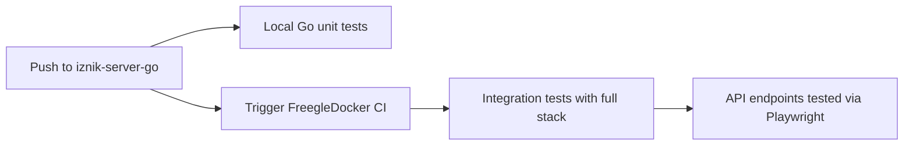

# CircleCI Continuous Integration

This repository uses CircleCI for continuous integration testing of the Go API server.

## Local CI Testing

This repository runs **Go-specific unit tests** in its own CircleCI environment:

### Test Suite
- **Unit Tests**: `go test ./test/...` - Tests all Go packages
- **Race Detection**: Tests run with `-race` flag to detect race conditions  
- **Benchmarks**: Performance benchmarks for API endpoints
- **Coverage**: Code coverage reporting (when enabled)

### Environment
- **Go Version**: Latest stable Go release
- **Database**: MySQL 8.0 with test schema
- **Dependencies**: All external services mocked for unit testing

## Integration Testing

**Integration tests run in the [FreegleDocker repository](https://github.com/Freegle/FreegleDocker), not here.**

### Why Separate Integration Testing?
- **Complete System Testing**: Tests Go API alongside PHP API, databases, and frontend
- **Production-Like Environment**: Full Docker Compose stack mirrors production
- **End-to-End Validation**: Playwright tests verify actual user workflows
- **Resource Efficiency**: One comprehensive test environment vs. multiple isolated ones

### Automated Triggering

When you push changes to this repository, it automatically:

1. **Runs Local Tests**: Go unit tests execute in this repository's CircleCI
2. **Triggers Integration Tests**: GitHub Actions webhook triggers FreegleDocker testing
3. **Full System Validation**: Complete Docker Compose environment tests your changes



## Webhook Configuration

This repository includes `.github/workflows/trigger-parent-ci.yml` that automatically triggers FreegleDocker testing.

### Setup Requirements
The webhook requires a `CIRCLECI_TOKEN` secret in this repository:

1. **Get Token**: CircleCI → Personal API Tokens
2. **Add Secret**: Repository Settings → Secrets and Variables → Actions
3. **Name**: `CIRCLECI_TOKEN` 
4. **Value**: Your CircleCI API token

### Webhook Status
✅ **Active** - Pushes to `master` automatically trigger FreegleDocker integration testing

## API Testing Approach

**Local Unit Tests (This Repository):**
- Route handler logic testing
- Database query validation  
- JWT authentication testing
- Model validation and serialization
- Service layer unit tests

**Integration Tests (FreegleDocker):**
- HTTP endpoint testing via Playwright
- Cross-service communication validation
- Database integration with real data
- Authentication flow testing
- Performance testing under load

## Environment Variables

Local CircleCI uses these test environment variables:
```bash
MYSQL_USER=root
MYSQL_PASSWORD=
MYSQL_PROTOCOL=tcp
MYSQL_HOST=127.0.0.1
MYSQL_PORT=3306
MYSQL_DBNAME=iznik
JWT_SECRET=secret
STANDALONE=TRUE
GOMAXPROCS=1
```

## Monitoring & Results

### Local Test Results
- View results at: [CircleCI iznik-server-go](https://app.circleci.com/pipelines/github/Freegle/iznik-server-go)
- Test artifacts include coverage reports and benchmarks

### Integration Test Results  
- View results at: [CircleCI FreegleDocker](https://app.circleci.com/pipelines/github/Freegle/FreegleDocker)
- Includes Playwright HTML reports and full system logs

## Development Workflow

1. **Write Go Code**: Implement API endpoints, models, services
2. **Add Unit Tests**: Test individual components in `test/` directory  
3. **Run Local Tests**: `go test ./test/...` for quick validation
4. **Push Changes**: Triggers both local and integration testing
5. **Monitor Results**: Check both CircleCI dashboards for results

## Related Documentation

- [Go API Documentation](README.md)
- [FreegleDocker Integration Testing](https://github.com/Freegle/FreegleDocker/blob/master/CircleCI.md)
- [API Testing Guide](https://github.com/Freegle/FreegleDocker/blob/master/README.md#testing)